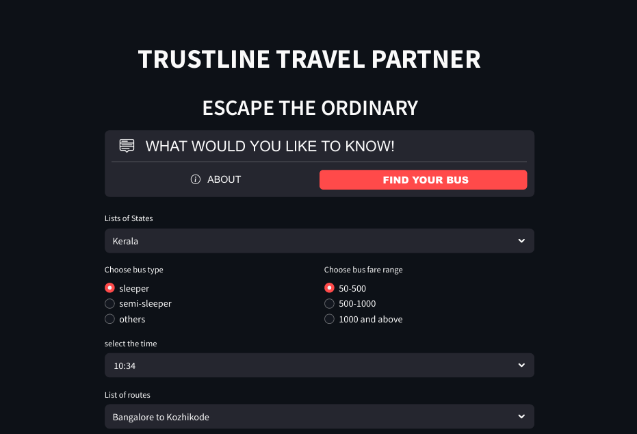

# 🚌 RedBus Route Recommendation System

An intelligent travel assistant that suggests optimal bus routes across Indian states based on real-time data insights. This project combines web scraping, data preprocessing, and machine learning to simplify travel planning within India.

## 🚀 Features

- 📍 **State-wise Bus Route Data**  
  Get curated bus route details for states like Kerala, Rajasthan, Goa, and 7 more.

- 🧠 **Smart Recommendations**  
  ML-powered suggestions based on origin-destination and regional data.

- 📊 **Interactive Visualizations**  
  Explore patterns and insights through Streamlit-based dashboards.

- 🧹 **TEC-TAGS**  
  Built using Python, Pandas,SQL and Streamlit in a clean project structure.

- 📍**Project Deliverables**
Source Code: Python scripts for data scraping, SQL database interaction, and Streamlit application.
Documentation: Detailed documentation explaining the code, data collection, and application usage.
Database Schema: SQL scripts to create and populate the database.
Application using Streamlit : Screenshots or links to the Streamlit application showing data filtering/ analysis.
---

## 📂 Project Structure

RED_BUS_project/
│
├── Bus_details/ # Preprocessed bus route data (per state)
├── csv_files/ # Raw scraped CSV files
├── scraper.ipynb # Web scraping code for RedBus
├── bus_details.ipynb # Data cleaning and integration
├── EDA&Sql_integration.ipynb # Exploratory Data Analysis + SQL patterns
├── redbus_app.py # Streamlit app for route recommendation
├── Route_details.csv # Final route mapping
├── .gitignore # Ignore unnecessary files like .venv/
└── requirements.txt # Python dependencies